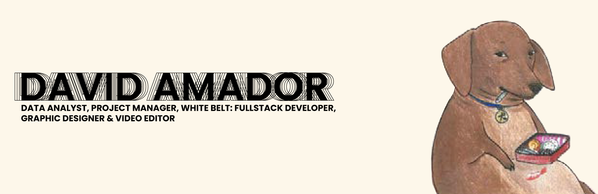

### Hello there 👋, I'm David

- 🔭 I’m currently a student in Platzi Master
- 🌱 I’m currently Backend development 
- 👯 I’m looking to collaborate on python projects
- 📫 How to reach me: davidamadorm@gmail.com
- 😄 Pronouns: he/his
- ⚡ Fun fact: Part time rodeo clown

## 🎯 &nbsp;&nbsp;Some technologies I use:

  &nbsp;&nbsp;
  &nbsp;&nbsp;
  &nbsp;&nbsp;
  &nbsp;&nbsp;
  &nbsp;&nbsp;
  &nbsp;&nbsp;
  

